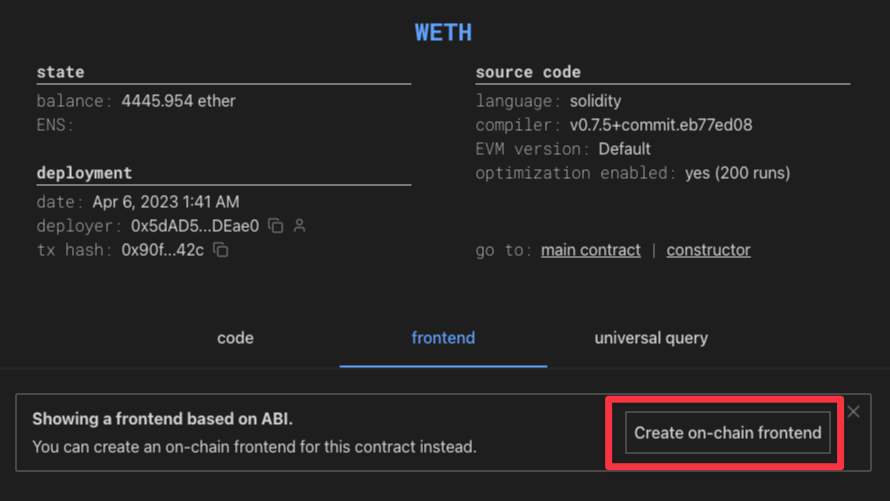

# Docs

## What is this?

The documentation for how to create simple frontends on-chain. <br/>
The frontends are deployed to the chain and served from there.

## Motivation

Why do we need to host frontends on the chain? 2 reasons: decentralization and composability.

1. **Decentralization** - allows frontends for smart contracts to be hosted in a decentralized manner.
2. **Composability** - allows to remix and build on top of other people’s work. So, the same “connect wallet” button won’t have to be implemented by every single frontend.

## How do I create a simple frontend?

Deploy this contract:

```Solidity
// SPDX-License-Identifier: MIT
pragma solidity ^0.8.19;

interface WETH {
    function decimals() external view returns (uint8);
    function name() external view returns (string memory);
    function symbol() external view returns (string memory);
    function totalSupply() external view returns (uint256);
    function allowance(address, address) external view returns (uint256);
    function balanceOf(address) external view returns (uint256);
}

interface IERC165 {
    function supportsInterface(bytes4 interfaceId) external view returns (bool);
}

interface IERCUI {
    /**
     * @notice Get HTML string for the given address.
     * @param forAddress who is this UI being shown to. Usually the connected wallet address.
     *        Implementations don't necessarily need to use this parameter but if used, allows for personalized UI.
     * @return string the HTML string. The HTML string can also include styles (via the <style> tag or inline styles).
     *        But <script> tag is prohibited.
     */
    function getUI(address forAddress) external view returns (string memory);
}

contract UIForWETH is IERCUI, IERC165 {
    // TODO: The addres is for Sepolia. If you want to deploy the contract on another chain, change the address
    WETH private constant wethContract = WETH(0x7b79995e5f793A07Bc00c21412e50Ecae098E7f9);

    function supportsInterface(bytes4 interfaceId) public view override returns (bool) {
        return interfaceId == type(IERCUI).interfaceId || interfaceId == type(IERC165).interfaceId;
    }

    function getUI(address forAddress) public view override returns (string memory) {
        return string.concat(
            "<div style=\"background-color: #27272a; color: white; font-size: 24px; padding: 40px;\">",
                "Total supply of WETH on ", getChainString(), " is ", floatToString(thisContract.totalSupply(), 1 ether, 1), " ETH",
            "</div>"
        );
    }

    function getChainString() public view returns (string memory) {
        if (block.chainid == 1) return "Ethereum";
        if (block.chainid == 5) return "Goerli";
        if (block.chainid == 11155111) return "Sepolia";
        if (block.chainid == 8453) return "Base";
        if (block.chainid == 84531) return "Base Goerli";
        return "Unknown Chain";
    }

    function floatToString(uint256 value, uint256 denominator, uint256 precision) private pure returns (string memory) {
        // Special case for 0
        if (value == 0) {
            return "0.000";
        }
        // Integer part
        uint256 integerValue = value / denominator;
        string memory intPart = uintToString(integerValue);

        // Fractional part (3 digits for precision)
        uint256 fractionalValue = value % denominator;
        uint256 scaledFractionalValue = fractionalValue * (10 ** precision) / denominator;
        string memory fracPart = _uintToStringWithZeros(scaledFractionalValue, precision);

        return string(abi.encodePacked(intPart, ".", fracPart));
    }

    function uintToString(uint256 value) private pure returns (string memory) {
        // Special case for 0
        if (value == 0) {
            return "0";
        }
        uint256 temp = value;
        uint256 digits;
        while (temp != 0) {
            digits++;
            temp /= 10;
        }
        bytes memory buffer = new bytes(digits);
        while (value != 0) {
            digits -= 1;
            buffer[digits] = bytes1(uint8(48 + uint256(value % 10)));
            value /= 10;
        }
        return string(buffer);
    }

    function _uintToStringWithZeros(uint256 value, uint256 precision) private pure returns (string memory) {
        bytes memory buffer = new bytes(precision);
        for (uint256 i = 0; i < precision; i++) {
            buffer[precision - 1 - i] = bytes1(uint8(48 + uint256(value % 10)));
            value /= 10;
        }
        return string(buffer);
    }
}
```

This contract is already deployed at [0x8cFFDb63527B5e0687B0dc25b488Aff57656A2F6](https://monobase.xyz/sepolia/address/0x8cFFDb63527B5e0687B0dc25b488Aff57656A2F6/code) on Sepolia.

Here is the frontend it creates:


You can view this frontend in real-time on [monobase](https://monobase.xyz/sepolia/address/0x8cFFDb63527B5e0687B0dc25b488Aff57656A2F6/frontend). Monobase makes it easy to play with the frontends by showing your changes live as you edit the code. Just go to your favorite contract, navigate to "frontend tab" and click on the "Create on-chain frontend" button.


## How does this work internally?

The idea is to create contracts that return HTML strings according to some standard (like ERC-20 or ERC-721). And then there will be wrappers that interpret/render this HTML. They are responsible for all the wiring like the RPC provider, wallet connections, etc.

[monobase.xyz](https://monobase.xyz) is one such wrapper. It’s actually easy to host your own wrapper. I’m planning to create an open source repo with a simple wrapper which you can clone and host anywhere. The code for the wrapper is not very complicated.

## The ERC

Let’s call it ERC-UI for now.

```Solidity
interface IERCUI {
    /**
     * @notice Get HTML string for the given address.
     * @param forAddress who is this UI being shown to. Usually the connected wallet address.
     *        Implementations don't necessarily need to use this parameter but if used, allows for personalized UI.
     * @return string the HTML string. The HTML string can also include styles (via the <style> tag or inline styles).
     *        But <script> tag is prohibited.
     */
    function getUI(address forAddress) external view returns (string memory);
}
```

The only functions your contract needs to implement in order to be considered a UI component are

1. `supportsInterface` (it needs to return `true` for `interfaceId=type(IERCUI).interfaceId`)
2. `getUI`

Almost all valid HTML is supported (including `<style>` tags). This standard is currently very malleable. Expect a lot of changes.

> One big caveat though is that Javascript is prohibited, so no `<script>` tags (at least for now). Allowing arbitrary JS prevents the easy composability of UI components. And since one of the big goals of this project is to allow easy composability, JS is not allowed.
>
> Instead, whenever you need JS (for stuff like interactivity), we use declarative HTML tag approach (outlined below in **Interactivity**). In the future, JS may be reconsidered if Solidity proves to be not enough.

## How do I build more complicated frontends?

Currently the following features are supported by the [monobase.xyz](https://monobase.xyz/) wrapper. Other wrappers can add more feature support. It would be ideal if these features are also part of the standard (maybe like extensions to ERC-UI - similar to the ERC721Enumerable extension)

- [**Interactivity**](interactivity.md) - instead of HTML being static, allow to add on-click handlers to things like buttons and forms.
- [**User input**](user-input.md) - allow to take input from user using `<form>`, `<input>`, etc. The values entered by the user will be validated by the wrapper (for example for address field, user won’t be able to enter 0xinvalid), and optionally can be validated by the contract too. The contract can access the values entered by the user.
- [**Wallet connection**](wallet-connection.md) - initiate a wallet connection if user is not already connected and get access to the connected address.
- [**Signing and sending transactions**](sign-and-send-tx.md) - request tx signature/send from user’s wallet. The contract will have access to the tx hash and the data returned from the tx
