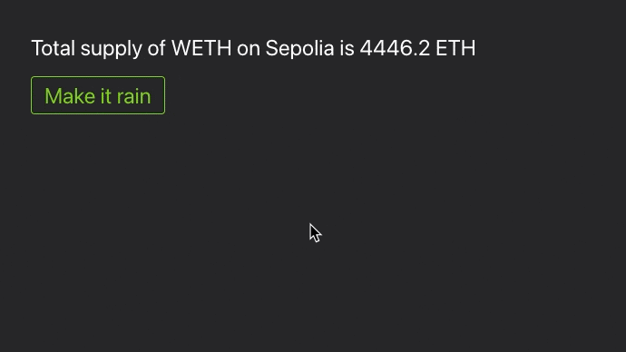

# Interactivity

If you don't want to limit your HTML to static content, you can make also make it interactive. You can add onClick handlers to buttons (without any JS) and create animations in CSS. Here is an example button ([deployed](https://monobase.xyz/sepolia/address/0x2fFad973A2f6c4C15003274511A4baA0D40C3147/frontend) on Sepolia):



And the code for it is simple:

```Solidity
function getUI(address forAddress) public view override returns (string memory) {
    bytes memory makeItRainCall = abi.encodeCall(this.makeItRainCall, (forAddress));
    return string.concat(
    	getStyle(),
        "<div id=\"container\" style=\"background-color: #27272a; color: white; font-size: 24px; padding: 40px;\">",
    		"<div>Total supply of WETH on ", getChainString(), " is ", floatToString(thisContract.totalSupply(), 1 ether, 1), " ETH", "</div>",
    		"<button ui-post=\"/this/", bytesToString(makeItRainCall), "\" ui-target=\"#container\" ui-swap=\"beforeend\" class=\"button\" style=\"display: block; margin-top: 20px;\">",
    			"Make it rain",
    		"</button>",
        "</div>"
    );
}

function makeItRainCall(address forAddress) public view returns (string memory) {
	return string.concat(
		"<div style=\"display: flex; gap: 20px; font-size: 42px;\">",
			"<div style=\"animation: slideDown ease-in 2s 0s infinite;\">",
				unicode"💵",
			"</div>",
			"<div style=\"animation: slideDown ease-in 2s 0.7s infinite;\">",
				unicode"💶",
			"</div>",
			"<div style=\"animation: slideDown ease-in 2s 0.3s infinite;\">",
				unicode"💴",
			"</div>",
		"</div>"
	);
}

function getStyle() public pure returns (string memory) {
	return string.concat(
		"<style>",
			".button {",
				"border: 1px solid #7dc71b;",
				"color: #7dc71b;",
				"padding: 8px 14px;",
				"border-radius: 4px;",
			"}",
			".button:hover {",
    			"background-color: #7dc71b;",
				"color: black;",
  			"}",
			"@keyframes slideDown {",
  				"0% {",
    				"transform: translateY(0);",
  				"}",
  				"100% {",
    				"transform: translateY(230px);"
  				"}",
			"}",
		"</style>"
	);
}
```

As you can see no, JS is required! The logic is done using Solidity via a declarative approach in HTML.
