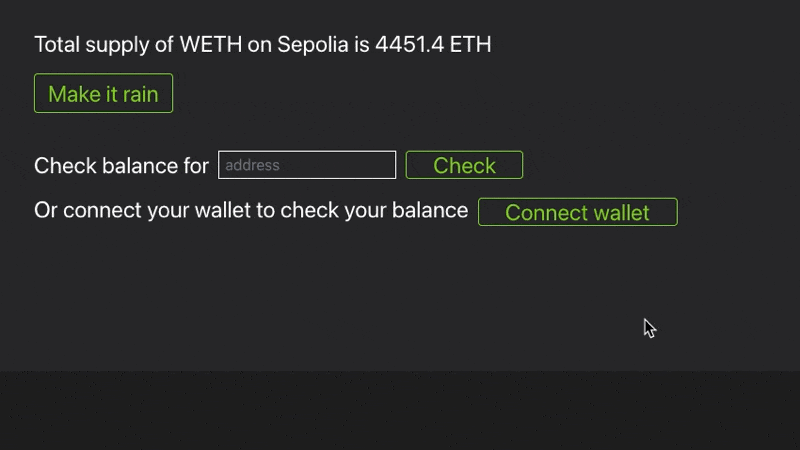

# Wallet connection

You can also implement a "Connect Wallet" button like this (deployed at [0x0a7b2C119be0a38C05e9c5d59a5BcF4f4Bfc9bFe](https://monobase.xyz/sepolia/address/0x0a7b2C119be0a38C05e9c5d59a5BcF4f4Bfc9bFe/frontend) on Sepolia):



Here is the code:

```Solidity
function getUI(address forAddress) public view override returns (string memory) {
    ...
    return string.concat(
    	...
    	forAddress == address(0) ? notConnected() : connected(forAddress),
    );
}

function notConnected() public view returns (string memory) {
	return string.concat(
		...
		"<div style=\"margin-top: 20px; display:flex; gap: 10px;\" id=\"connect-wallet-container\">",
			"Or connect your wallet to check your balance ",
			"<button type=\"connect-wallet\" ui-post=\"/this/", bytesToString(abi.encodePacked(this.onConnected.selector)), "$ui-connectedAddress\" ui-target=\"#connect-wallet-container\" ui-swap=\"outerHTML\" class=\"button center-children\">",
				"Connect wallet", loadingSpinner(),
			"</button>",
		"</div>"
	);
}

function onConnected(address connectedAddress) public view returns (string memory) {
	return string.concat(
		"Connected with ", bytesToString(abi.encodePacked(connectedAddress)), "!"
	);
}

function connected(address forAddress) public view returns (string memory) {
	return string.concat(
		"<div style=\"margin-top: 20px;\">",
			"Balance for your address (", bytesToString(abi.encodePacked(forAddress)), ") is ", floatToString(thisContract.balanceOf(forAddress), 1 ether, 2), " ETH",
		"</div>"
	);
}
```

As you can see, all you have to do implement a "Connect wallet" button is to annotate your `<button>` with `type="connect-wallet"`. Then you can access the `connected address` by the special variable `$ui-connectedAddress` (of type `address`). In the example above, we access it using `ui-post="/this/0x6438c4d5$ui-connectedAddress"`, where `0x6438c4d5` is the function selector of `onConnected` function.

The wrapper is expected to do a full reload when the connected address changes. So that's why you see the UI updating after I connect my wallet. There is also a brief message saying `"Connected with 0x123..."` that's shown immediately to the user before any UI update takes place.

Connecting a wallet allows you to create personalized frontends via the `forAddress` function argument. You can fetch the user's balance, insert user-specific actions, etc.
